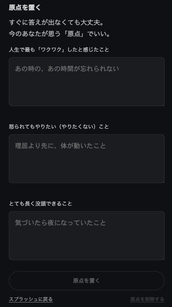

  

# TRACE

迷いは消えない。  
でも、軌跡は残る。

立ち止まった場所も、遠回りも、  
すべて「今の自分」として残していく。

TRACE は  
**自分の現在地を評価せずに、静かに記録するための Web アプリ**です。

近い・遠いに正解はありません。  
今週の距離感と言葉を、そのまま残していきます。

---

## 原点を置く

  

TRACE では最初に、  
「今のあなたの原点」を言葉で置きます。

---

## できること

  

- 今週の距離感を「言葉」で置く
- ひとつの問いに、短く答える
- 距離とことばの関係を、余韻として残す
- これまでの一歩を、静かに振り返る

  

※ 前回と距離カテゴリが変わった週は  
　月明かりに照らされるように表示されます。

---

## 使い方

1. 原点（大切にしていること）を置く
2. 週に一度、問いに短く答える
3. 距離とことばの変化を、静かに振り返る

---

## コンセプト

TRACE は成長を測るツールではありません。  
評価せず、比較せず、  
**ただ「歩いた事実」を残す**ためのアプリです。

---

## 技術構成

- React + Vite
- State 管理：useState / useMemo
