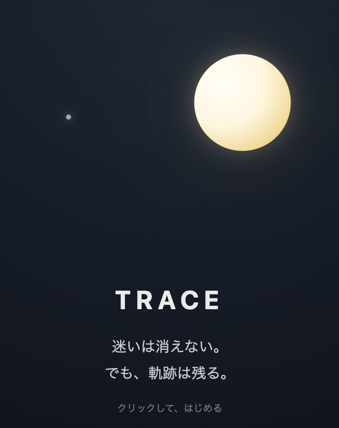
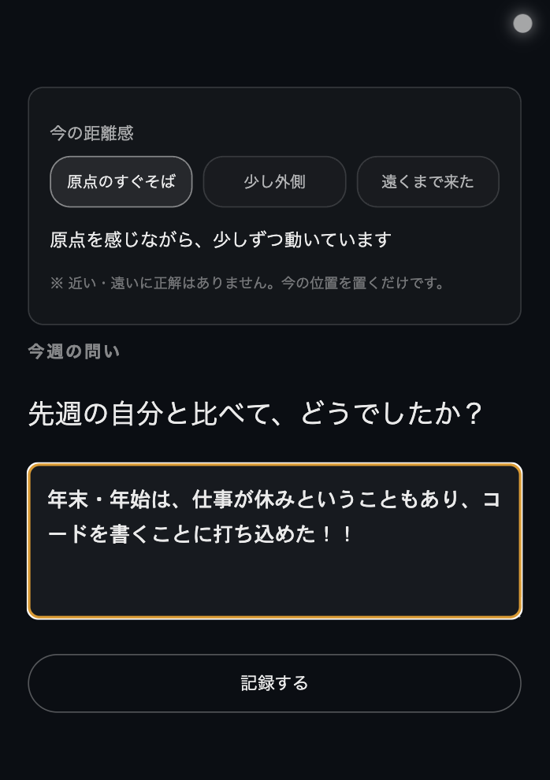
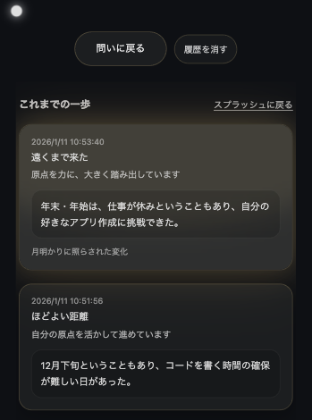

# TRACE

迷いは消えない。  
でも、軌跡は残る。

TRACE は  
**自分の現在地を評価せずに、静かに記録するための Web アプリ**です。

近い・遠いに正解はありません。  
今週の距離感と言葉を、そのまま残していきます。

---

## できること

- 今週の距離感を「言葉」で置く
- ひとつの問いに、短く答える
- 距離とことばの関係を、余韻として残す
- これまでの一歩を、静かな履歴として振り返る

※ 前回と距離カテゴリが変わった週は  
　月明かりに照らされるように表示されます。

---

## コンセプト

TRACE は成長を測るツールではありません。  
評価せず、比較せず、  
**ただ「歩いた事実」を残す**ためのアプリです。

---

## 技術構成

- React + Vite
- Styling：JS styles + CSS（演出）
- State 管理：useState / useMemo

---

## これから

- 原点の再定義
- 長期的な軌跡の可視化
- 保存・共有機能
